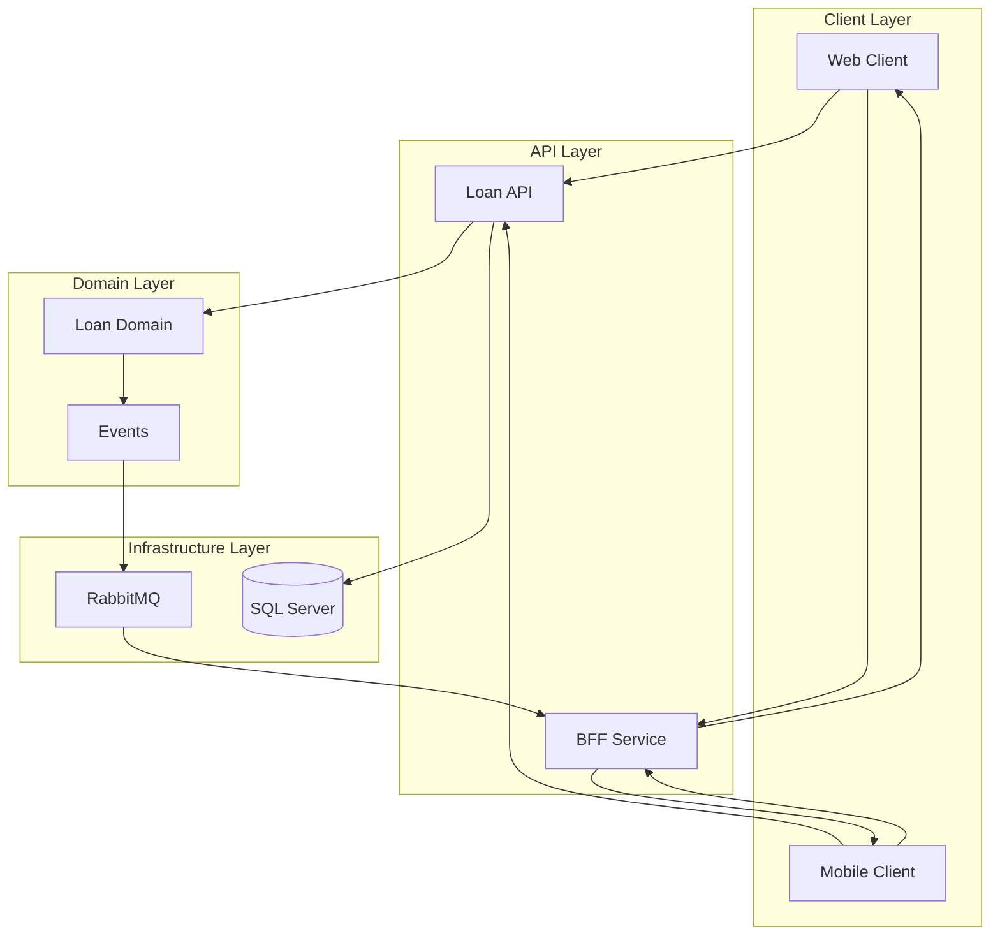
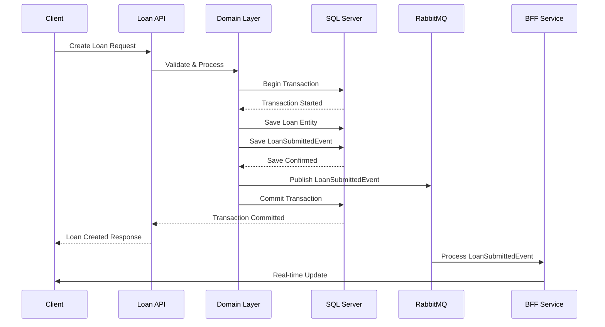
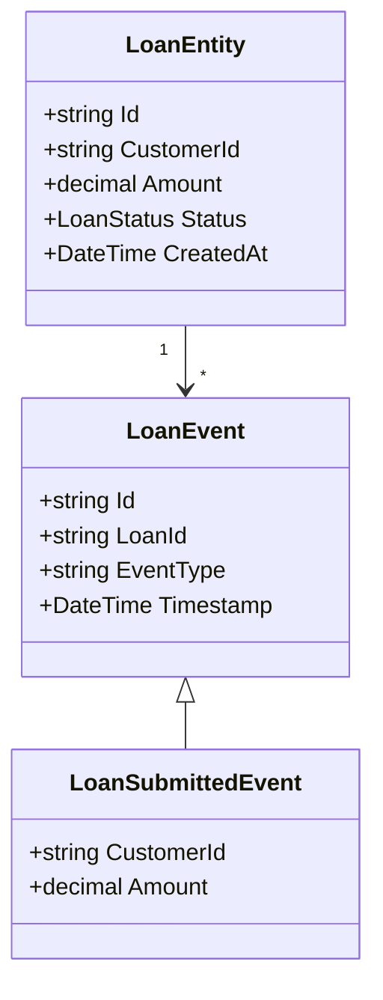
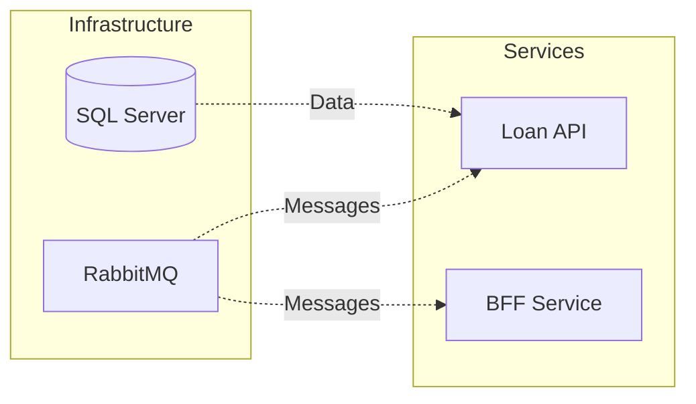
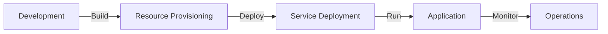

# Building a Modern Loan Management System with Event-Driven Architecture in .NET

### High-Level Architecture Overview



### Event Flow Architecture



## Implementation Details

### 1. Core Components

#### Loan API Controller
```csharp
[ApiController]
[Route("api/[controller]")]
public class LoansController : ControllerBase
{
    [HttpPost]
    public async Task<ActionResult<CreateLoanResponse>> CreateLoan(CreateLoanRequest request)
    {
        // Validation and business logic
        var loanId = $"LOAN-{DateTime.UtcNow:yyyyMMdd}-{Guid.NewGuid().ToString("N")[..8]}";
        
        // Create and save loan entity
        var loan = new LoanEntity
        {
            Id = loanId,
            CustomerId = request.CustomerId,
            Amount = request.Amount,
            Status = LoanStatus.Submitted
        };

        // Create and save event
        var submittedEvent = new LoanSubmittedEvent
        {
            LoanId = loan.Id,
            Amount = request.Amount,
            CustomerId = request.CustomerId
        };

        // Save and publish
        await SaveAndPublishAsync(loan, submittedEvent);
        
        return Ok(new CreateLoanResponse { LoanId = loan.Id });
    }
}
```

#### Domain Model



#### BFF Consumer
```csharp
public class LoanSubmittedConsumer : IConsumer<LoanSubmittedIntegrationEvent>
{
    private readonly ILogger<LoanSubmittedConsumer> _logger;

    public async Task Consume(ConsumeContext<LoanSubmittedIntegrationEvent> context)
    {
        var message = context.Message;
        _logger.LogInformation("Processing loan submission: {LoanId}", message.LoanId);
        
        // Process the event and update clients
        await ProcessLoanSubmissionAsync(message);
    }
}
```

### 2. Infrastructure Setup



## Architectural Patterns Implemented

### 1. Event Sourcing
- Complete audit trail through event storage
- State reconstruction capability
- Temporal query support
- Business event tracking

### 2. CQRS (Command Query Responsibility Segregation)
- Separated read and write operations
- Optimized query performance
- Scalable command handling
- Clear responsibility separation

### 3. Domain-Driven Design
- Rich domain models
- Bounded contexts
- Aggregates and entities
- Value objects

## Key Features and Benefits

### 1. Scalability
- Independent service scaling
- Message-based communication
- Stateless services
- Event-driven processing

### 2. Maintainability
- Clear separation of concerns
- Modular design
- Testable components
- Clean architecture principles

### 3. Reliability
- Transactional consistency
- Message persistence
- Retry policies
- Error handling

### 4. Security
- HTTPS enforcement
- Authorization middleware
- Input validation
- Secure configuration

## Technical Implementation Highlights

### 1. Database Design
```sql
CREATE TABLE Loans (
    Id NVARCHAR(50) PRIMARY KEY,
    CustomerId NVARCHAR(50) NOT NULL,
    Amount DECIMAL(18,2) NOT NULL,
    Status NVARCHAR(20) NOT NULL,
    CreatedAt DATETIME2 NOT NULL
);

CREATE TABLE LoanEvents (
    Id NVARCHAR(50) PRIMARY KEY,
    LoanId NVARCHAR(50) NOT NULL,
    EventType NVARCHAR(50) NOT NULL,
    Data NVARCHAR(MAX) NOT NULL,
    Timestamp DATETIME2 NOT NULL,
    FOREIGN KEY (LoanId) REFERENCES Loans(Id)
);
```

### 2. Message Integration
```csharp
builder.Services.AddMassTransit(x =>
{
    x.UsingRabbitMq((context, cfg) =>
    {
        cfg.Host(builder.Configuration.GetConnectionString("messaging"));
        cfg.UseMessageRetry(r => r.Intervals(100, 200, 500, 800, 1000));
    });
});
```

## Development and Deployment

### 1. Local Development
```powershell
# Start infrastructure
docker-compose up -d

# Run migrations
dotnet ef database update

# Start services
dotnet run --project src/Bank.Loan.Api
dotnet run --project src/Bank.Loan.Bff
```

### 2. Production Deployment


## Future Enhancements

1. **Observability**
   - Distributed tracing
   - Metrics collection
   - Enhanced logging correlation

2. **Resilience**
   - Circuit breaker patterns
   - Bulkhead pattern
   - Timeout policies

3. **Security**
   - Authentication
   - API rate limiting
   - Message encryption

4. **Scalability**
   - Caching layer
   - Read replicas
   - Load balancing

## Conclusion

This implementation of a loan management system demonstrates how modern architectural patterns and technologies can be combined to create a robust, scalable, and maintainable solution. The event-driven architecture provides flexibility and scalability, while domain-driven design ensures a clean and maintainable codebase.

The system is well-positioned for future growth and can be extended to support additional features and requirements. The combination of CQRS, event sourcing, and message-based integration provides a solid foundation for building complex financial applications.

### Key Takeaways

1. Event sourcing provides excellent audit capabilities and flexibility
2. CQRS enables optimal read and write operations
3. Message-based integration allows for loose coupling and scalability
4. Domain-driven design promotes maintainable and understandable code
5. Modern .NET features enable clean and efficient implementation

The architecture and implementation patterns discussed here can serve as a template for building similar systems in financial or other domains where reliability, scalability, and maintainability are crucial requirements.
